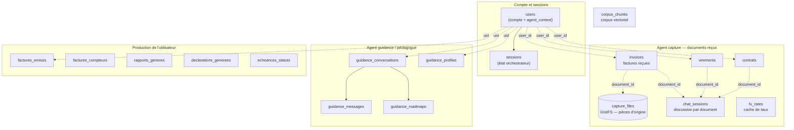

# Architecture de la base de données — LedgerMind

> Document de compréhension. Établi en lisant le code **et** en inspectant l'instance
> MongoDB locale le 2026-08-03. Les volumes cités sont ceux de votre base de
> développement à cette date : ils illustrent, ils ne font pas foi.

---

## 1. En une phrase

Tout tient dans **MongoDB**, sans ORM ni migrations : chaque module crée ses
propres collections et ses index à la première écriture. Il n'y a **aucune
jointure** — les liens entre collections se font par des identifiants applicatifs
que le code résout lui-même.

---

## 2. Deux bases, pas une

| Base | Rôle | Créée par |
|---|---|---|
| `ledgermind` | Toutes les données métier | l'application |
| `ledgermind_checkpoints` | État interne du graphe LangGraph (agent capture) | la bibliothèque LangGraph |

La seconde n'est **jamais** lue ni écrite par votre code. Elle sert uniquement à
LangGraph pour geler un traitement interrompu — c'est ce qui permet à une analyse
de document de survivre entre deux requêtes HTTP quand l'agent pose une question
à l'utilisateur.

Les noms viennent de `MONGO_DB_NAME` dans `backend/.env` ; la base de checkpoints
est toujours nommée `<MONGO_DB_NAME>_checkpoints`.

Point d'entrée unique côté code : [backend/app/core/mongo.py](../backend/app/core/mongo.py)
expose un client partagé (`get_client`, `get_db`) créé une seule fois par
processus, protégé par un verrou.

---

## 3. Vue d'ensemble



Les flèches en pointillés ne sont **pas** des clés étrangères : MongoDB n'en a
pas. Ce sont des conventions que le code applique à chaque requête.

---

## 4. Le piège des identifiants

C'est le point qui déroute le plus à la lecture. **Quatre** identifiants
circulent, et deux d'entre eux désignent la même chose sous deux noms.

| Identifiant | Où | Désigne |
|---|---|---|
| `id` (dans `users`) | `users.id` | le compte — un UUID |
| `user_id` | collections de l'agent capture | **le même** `users.id` |
| `uid` | collections guidance et production | **le même** `users.id` encore |
| `session_id` | `sessions.id` | un parcours d'orchestrateur, pas un compte |
| `document_id` | capture | une pièce déposée |
| `thread_id` | base checkpoints | une exécution du graphe LangGraph |

> **À retenir :** `user_id` et `uid` sont deux noms pour la clé de compte. La
> divergence vient de l'histoire du projet — l'agent guidance a été porté depuis
> un prototype qui disait `uid`. Ce n'est pas une distinction sémantique.

`thread_id` mérite une précision : il est créé à chaque `POST /api/capture/analyze`
et vit dans la base de checkpoints. Il n'a **pas** de rapport avec `document_id` :
un même document peut avoir plusieurs threads si l'analyse a été relancée.

---

## 5. Les collections, une par une

### 5.1 Compte et sessions

#### `users` — le pivot de tout

Un document par compte. Contient les identifiants, le mot de passe **haché**
(bcrypt, jamais en clair), et surtout `agent_context` : un bloc imbriqué qui
résume l'état de chaque agent pour ce compte.

```
users
├── id            UUID — la clé référencée partout ailleurs
├── email         UNIQUE
├── name
├── password_hash
├── created_at / updated_at
└── agent_context
    ├── intake     { last_session_id, phase, profile, roadmap, … }
    ├── guidance   { idem }
    ├── capture    { last_thread_id, last_document_id, history[] }
    └── referral   { history[] }
```

**Index :** `email` UNIQUE · `id` UNIQUE

`agent_context` est une **dénormalisation assumée** : ces données existent déjà
dans `sessions` et dans les collections de capture. Elles sont recopiées ici pour
qu'un seul appel à `/api/auth/me` suffise à reconstituer l'écran d'accueil, sans
interroger cinq collections.

⚠️ Conséquence directe : toute suppression ailleurs doit nettoyer ici aussi.
C'est pourquoi supprimer un document appelle `_forget_capture_history`
([capture.py](../backend/app/api/capture.py)) — sans ça, une pièce effacée
continuerait d'apparaître dans le fil d'activité.

#### `sessions` — l'état de l'orchestrateur

Un document par parcours. Le champ `state_json` porte l'intégralité de l'état
sérialisé (`OrchestratorState`), pas des colonnes éclatées.

**Index :** `id` UNIQUE · `updated_at` · `user_id`

---

### 5.2 Agent capture — les documents reçus

Trois collections **de même forme**, une par type de pièce. La séparation est
délibérée : chacune a sa propre clé de déduplication.

| Collection | Bloc métier | Clé de déduplication (UNIQUE) |
|---|---|---|
| `invoices` | `invoice` | `user_id` + `invoice_number` + `issuer_tax_id` + `total_ttc` + `issue_date` |
| `virements` | `transfer` | `user_id` + `transfer_reference` + `amount` + `execution_date` |
| `contrats` | `contract` | `user_id` + `reference` + `contract_type` + `signature_date` + `amount` |

Structure commune (exemple d'une facture) :

```
invoices
├── user_id, document_id
├── document_type      "facture" | "virement" | "contrat"
├── filename, mime, has_file      ← la pièce d'origine est-elle conservée ?
├── invoice { … }                 ← le bloc métier extrait
├── analysis                      ← la synthèse rédigée
├── incoherences[]                ← contrôles déterministes
├── ocr_text, ocr_text_original, detected_language
├── writing_mode, uncertain_fields[]   ← lecture manuscrite
├── corrected_fields[]                 ← champs corrigés à la main
├── created_at
└── invoice_number, issuer_tax_id, total_ttc, issue_date   ← MIROIRS
```

> **Les « miroirs » sont le détail non évident.** Les champs de la clé de
> déduplication sont recopiés **à la racine** du document, alors qu'ils existent
> déjà dans le bloc `invoice`. Raison : un index MongoDB ne peut pas porter
> proprement sur des champs imbriqués mêlés à une contrainte d'unicité par
> utilisateur. Toute correction doit mettre à jour **les deux** — sinon l'index
> travaille sur des valeurs périmées et un vrai doublon passe. C'est traité dans
> `update_document_fields` ([nodes.py](../backend/app/agents/capture/app/nodes.py)).

**Pourquoi `user_id` dans la clé unique ?** Deux créateurs différents peuvent
légitimement recevoir une facture n° 001 du même fournisseur. Sans `user_id`,
l'unicité serait globale et la pièce du second serait rejetée comme doublon.

#### `capture_files` — GridFS

```
capture_files.files    métadonnées (filename, length, uploadDate, metadata)
capture_files.chunks   le contenu, découpé en morceaux
```

C'est **GridFS**, le mécanisme MongoDB pour stocker des fichiers dépassant la
limite de 16 Mo d'un document BSON. L'interface annonce 20 Mo par pièce : un
document classique ne pouvait donc pas convenir.

`metadata` porte `{user_id, document_id, mime}` — c'est ce qui permet de
retrouver la pièce d'un document **et** de garantir qu'un autre compte n'y accède
pas.

#### `chat_sessions` — la discussion par document

Un document par couple `(user_id, document_id)`, avec un tableau `messages`.
La première entrée est la synthèse produite à l'analyse.

**Index :** `(user_id, document_id)` UNIQUE

#### `fx_rates` — cache de taux de change

```
{ currency, date, rate, source }
```

**Index :** `(currency, date)` UNIQUE

Évite de rappeler l'API de taux à chaque affichage. `source` vaut `"BCE"` ou
`"Currency-API"` : les deux ne donnent pas exactement le même taux, la provenance
doit donc suivre le chiffre.

---

### 5.3 Agent guidance / pédagogue

Portées depuis un prototype SQLite, d'où le préfixe `guidance_` et l'usage de
`uid`.

| Collection | Contenu | Index |
|---|---|---|
| `guidance_conversations` | `{id, uid, type, title, created_at, updated_at}` — `type` vaut `guidance` ou `pedagogue` | `id` UNIQUE · `(uid, type, updated_at)` |
| `guidance_messages` | `{conversation_id, role, content, sources, created_at}` | `(conversation_id, created_at)` |
| `guidance_profiles` | profil **partagé par compte**, pas par conversation | `uid` UNIQUE |
| `guidance_roadmaps` | `{conversation_id, roadmap, checked}` | `conversation_id` UNIQUE |

> Le profil est indexé par `uid` et non par conversation : ce que l'utilisateur
> dit dans un espace reste connu de l'autre. C'est un choix produit, pas un
> accident de modélisation.

---

### 5.4 Ce que l'utilisateur produit

| Collection | Rôle | Index |
|---|---|---|
| `factures_emises` | factures **émises** par l'utilisateur à ses clients | `(uid, numero)` UNIQUE · `(uid, date_emission)` |
| `factures_compteurs` | compteur de numérotation séquentielle | — |
| `rapports_generes` | rapports d'activité archivés | `(uid, date_debut)` |
| `declarations_generees` | déclarations préparées | `(uid, date_debut)` |
| `echeances_statuts` | confirmations manuelles « marqué comme payé » | `(uid, obligation_id, periode)` UNIQUE |

⚠️ **Ne pas confondre `invoices` et `factures_emises`.** La première porte les
factures **reçues** (fournisseurs, dépenses) ; la seconde les factures **émises**
(clients, recettes). Noms proches, sens opposés.

`factures_compteurs` mérite un mot : la numérotation sans rupture est une
obligation légale. Le compteur est incrémenté par `find_one_and_update` avec
`$inc`, atomique côté MongoDB — deux requêtes simultanées ne peuvent pas obtenir
le même numéro.

`echeances_statuts` ne contient **que** des confirmations manuelles :
LedgerMind ne peut pas savoir qu'un paiement officiel a eu lieu, seul
l'utilisateur le déclare après être passé par le portail.

---

### 5.5 `corpus_chunks` — le corpus vectoriel

```
{ chunk_id, texte, embedding[], concerne, titre, source, … }
```

**Index :** `chunk_id` UNIQUE · `concerne`

La similarité cosinus est calculée **en Python**, sur les vecteurs chargés en
mémoire. Pas de base vectorielle dédiée : le corpus fait quelques milliers de
chunks, le filtrage par public (`concerne`) se fait côté Mongo pour ne charger
que le sous-ensemble utile.

Le commentaire du module indique le seuil de bascule : au-delà d'environ
**50 000 chunks**, passer à un index `vectorSearch` (MongoDB Atlas) sans changer
l'interface — `query()` reste le seul point d'entrée.

Cette collection est vide tant que `python -m backend.scripts.seed_corpus`
n'a pas été lancé.

---

## 6. Comment les index sont créés

Il n'y a **pas de migrations**. Chaque module possède un `_ensure_schema()` ou
`ensure_indexes()` appelé à la première écriture, protégé par un verrou et un
drapeau `_initialized` pour ne s'exécuter qu'une fois par processus.

Conséquence pratique : **une collection n'existe pas tant que rien n'y a été
écrit**. Au moment de l'inspection, `declarations_generees` et
`echeances_statuts` étaient absentes de la base bien que déclarées dans le code
— simplement parce qu'aucune déclaration n'avait encore été produite.

Le cas de l'agent capture est plus élaboré : `_ensure_unique_index`
([db.py](../backend/app/agents/capture/app/db.py)) **supprime** toute ancienne
contrainte d'unicité portant sur d'autres clés avant de créer la bonne. C'est ce
qui a permis de faire évoluer la clé de déduplication (ajout de `user_id`) sans
migration manuelle.

---

## 7. Ce qui n'est pas dans MongoDB

Deux catégories de données vivent volontairement **hors** de la base :

| Où | Quoi | Pourquoi |
|---|---|---|
| `data/*.yaml` | seuils fiscaux, taux, barème IR, régimes | Ce sont des données du **produit** — sourcées, datées, revues à la main. Les sortir rend leur revue lisible dans les diffs Git. |
| `backend/.env` | clés d'API, URI Mongo, secret JWT | Secrets, jamais versionnés |

C'est une règle du projet : **aucun seuil ni taux codé en dur**, et aucun stocké
en base. Voir [data/seuils.yaml](../data/seuils.yaml) et
[data/impot_revenu.yaml](../data/impot_revenu.yaml).

---

## 8. Principes de conception observés

1. **Une collection par préoccupation**, jamais de table fourre-tout.
2. **Cloisonnement par compte systématique.** Toute requête filtre sur
   `user_id`/`uid`. Un document sans ce filtre serait une fuite entre comptes.
3. **Unicité par compte, pas globale.** Les clés uniques incluent toujours
   l'identifiant du compte.
4. **Dénormalisation choisie et assumée** (`agent_context`, miroirs de racine),
   avec la charge de synchronisation que cela impose.
5. **Index créés à l'usage**, pas par migration.
6. **Pas de suppression en cascade automatique** : elle est écrite à la main.
   `delete_document` efface quatre traces — la ligne métier, le fichier GridFS,
   la discussion et l'entrée d'activité du compte.

---

## 9. Pour inspecter vous-même

```bash
# Lister les collections
mongosh ledgermind --eval "db.getCollectionNames()"

# Voir les index d'une collection
mongosh ledgermind --eval "db.invoices.getIndexes()"

# Un document complet
mongosh ledgermind --eval "db.invoices.findOne()"

# Diagnostic fourni par le projet (capture)
python backend/app/agents/capture/check_db.py
```

---

## 10. État observé le 2026-08-03

Base `ledgermind` — 16 collections :

| Collection | Documents |
|---|---|
| `sessions` | 20 |
| `guidance_messages` | 14 |
| `chat_sessions` | 9 |
| `capture_files.files` / `.chunks` | 6 / 6 |
| `invoices` | 5 |
| `users` | 5 |
| `guidance_conversations`, `guidance_profiles` | 3 chacune |
| `fx_rates` | 3 |
| `virements` | 2 |
| `contrats`, `guidance_roadmaps` | 1 chacune |
| `corpus_chunks`, `factures_emises`, `rapports_generes` | 0 |

Base `ledgermind_checkpoints` — 2 collections : `checkpoints` (112) et
`checkpoint_writes` (372). Ces volumes croissent à chaque analyse de document et
ne sont **jamais purgés automatiquement** : c'est le point à surveiller en
premier si la base grossit anormalement.
